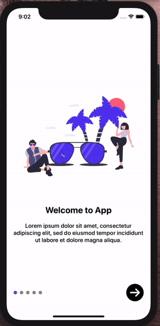

# SwiftUI Onboarding

## Demo
Video is worth a thousand words



## Instructions
Update `OnboardingDataModel.swift` with your data, each entry in the array will add new onboarding screen.

```swift
extension OnboardingDataModel {
    static var data: [OnboardingDataModel] = [
        OnboardingDataModel(image: "onboarding-relax", heading: "Welcome to App", text: "Lorem ipsum dolor sit amet, consectetur adipiscing elit, sed do eiusmod tempor incididunt ut labore et dolore magna aliqua."),
        OnboardingDataModel(image: "onboarding-lookingatart", heading: "Explore the World", text: "Lorem ipsum dolor sit amet, consectetur adipiscing elit, sed do eiusmod tempor incididunt ut labore et dolore magna aliqua."),
        OnboardingDataModel(image: "onboarding-sharing1", heading: "Live Life Baby", text: "Lorem ipsum dolor sit amet, consectetur adipiscing elit, sed do eiusmod tempor incididunt ut labore et dolore magna aliqua."),
        OnboardingDataModel(image: "onboarding-security1", heading: "Work Hard", text: "Lorem ipsum dolor sit amet, consectetur adipiscing elit, sed do eiusmod tempor incididunt ut labore et dolore magna aliqua."),
        OnboardingDataModel(image: "onboarding-showclients", heading: "Stay Careless", text: "Lorem ipsum dolor sit amet, consectetur adipiscing elit, sed do eiusmod tempor incididunt ut labore et dolore magna aliqua."),
    ]
}
```

## Tricks
For hooking into `Done` button click I have implemented escaping closure.

```swift
OnboardingViewPure(data: data, doneFunction: {
    /// Update your state here
    self.onboardinDone = true
    print("done onboarding")
})
```